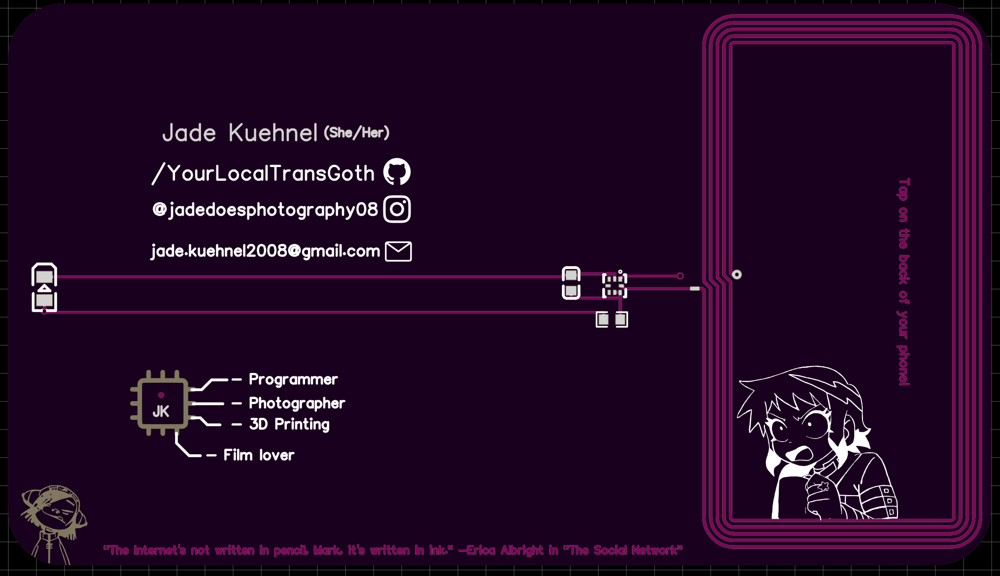

Here is the design of my PCB business card

The front! 

And the back!

This was my first PCB I have ever designed. It took me a few hours to design and then figure out what art and text to put on the card. It uses a 17-21SUYC/TR8 LED, a 220nF capacitor, a 47Ω resistor, and a NT3H2111W0FHKH NFC chip along with a antenna. I really enjoyed working on this small project!
